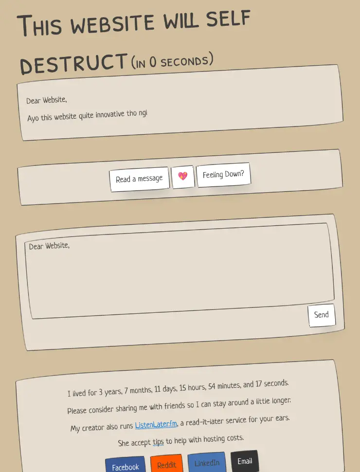

# twwsd-capsule

Simple Bun web server for hosting a time capsule of ThisWebsiteWillSelfDestruct after its shutdown.



To use this project, you must have an SQLite database with a table called `letters`. This table will contain the letters that will be shown randomly.

```sql
CREATE TABLE letters(
    id INTEGER PRIMARY KEY,
    twwsd_id INTEGER UNIQUE NOT NULL,
    body TEXT NOT NULL
);
```

## Docker Usage

```
sudo docker run --rm -it -p 8080:8080 -v "$(pwd)/twwsd.db":/usr/src/app/twwsd.db:ro ghcr.io/pixelomer/twwsd-capsule:latest
```
